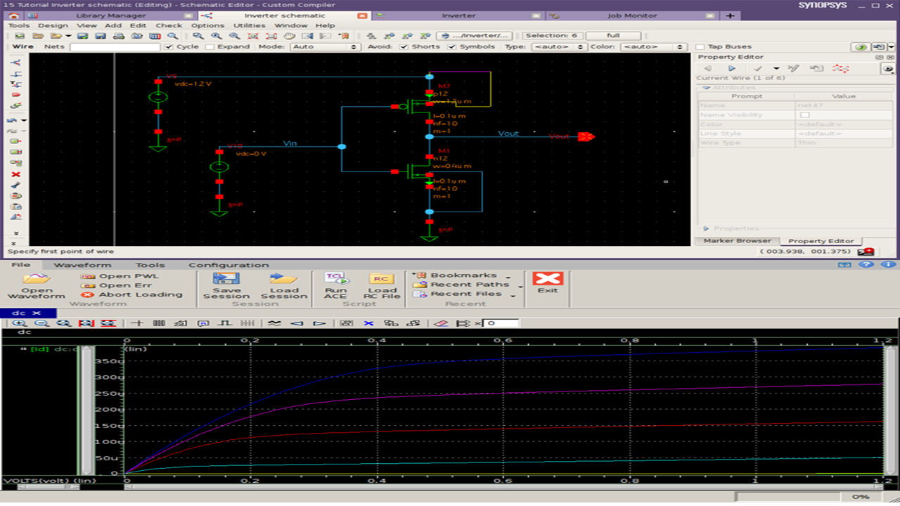
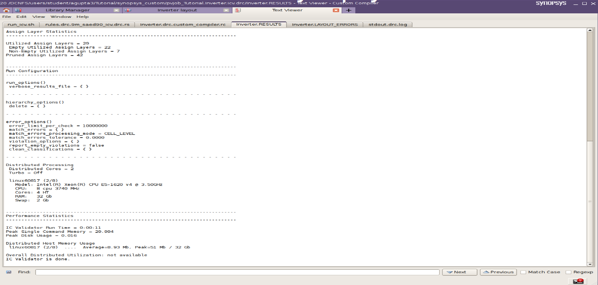
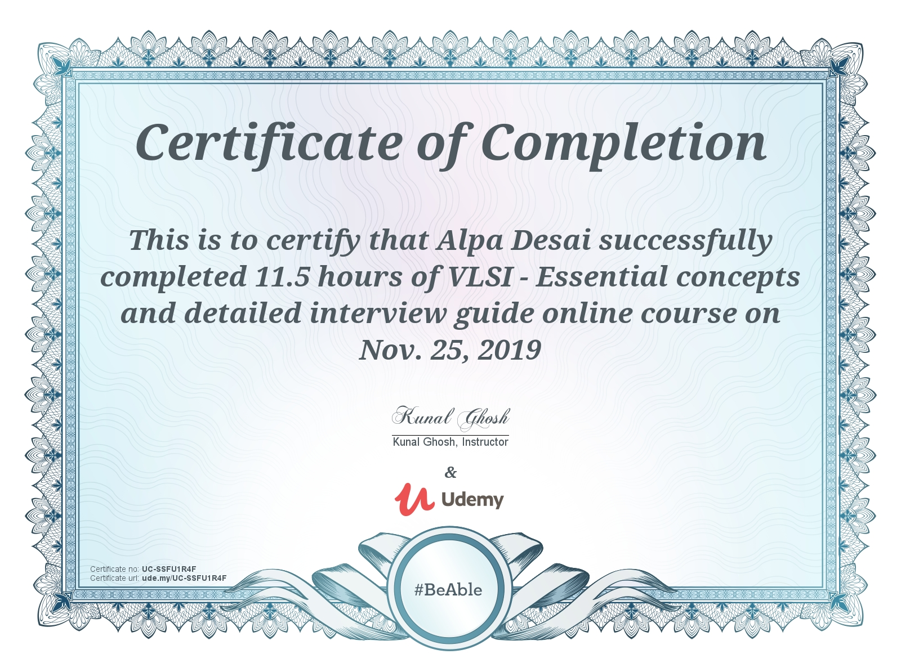

# Analog Design and VLSI Design

The project displays technical knowledge on the described topics. Please click on the following link to download the executable:
https://github.com/alpaddesai/AnalogDesign/releases

Company confidential information is not displayed. All images are either custom by Alpa D Desai or a reference name is included.Most of the images are custom. 

## Schematic Design

## CMOS Analog Design Certification

## Design layout
!

## VLSI Design Certification

