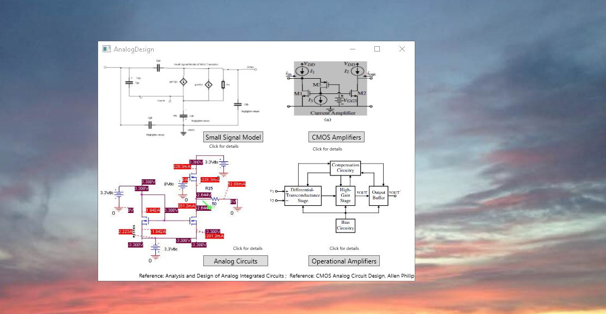
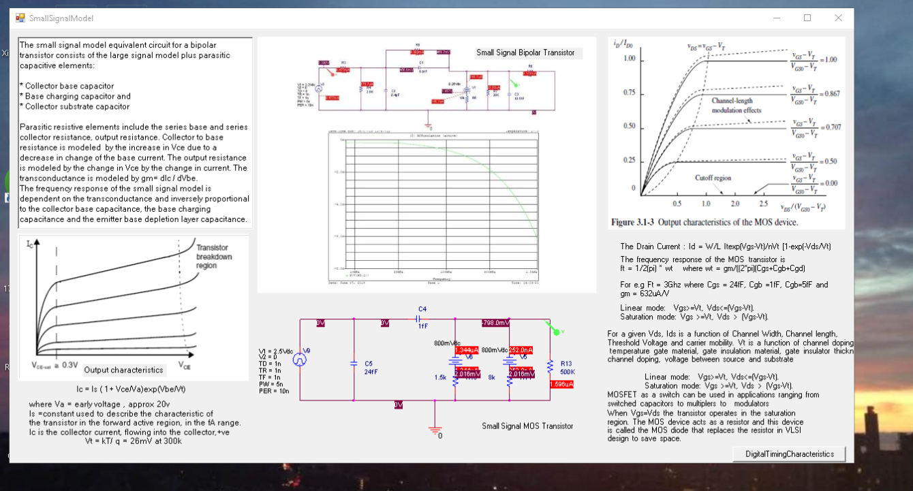
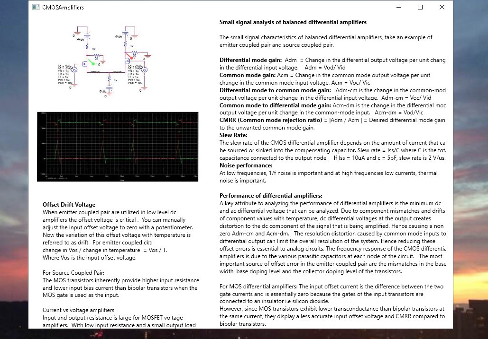
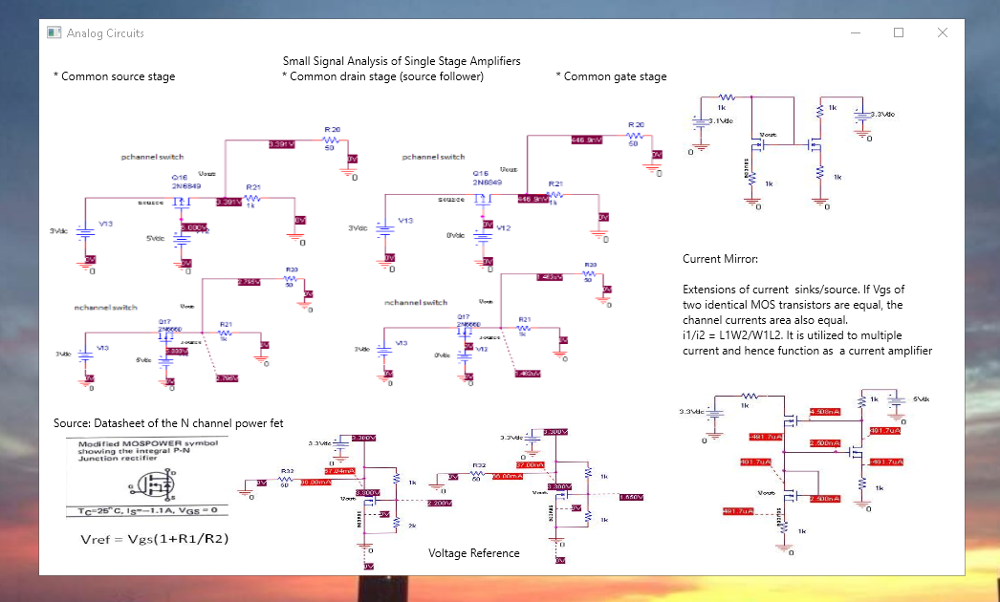
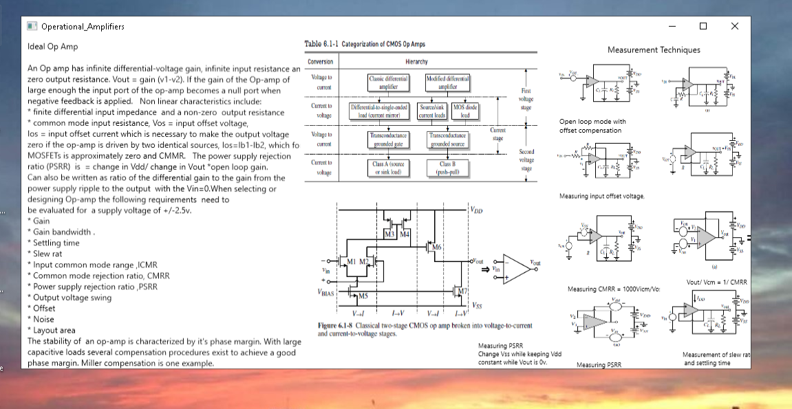
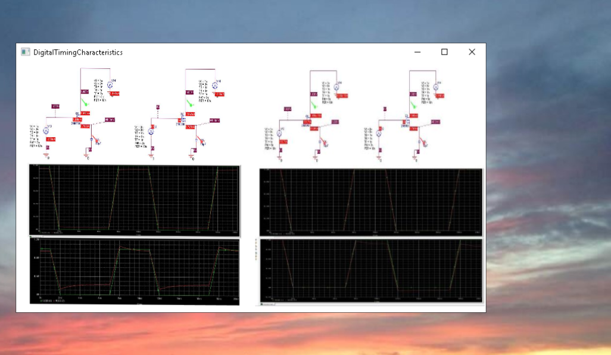
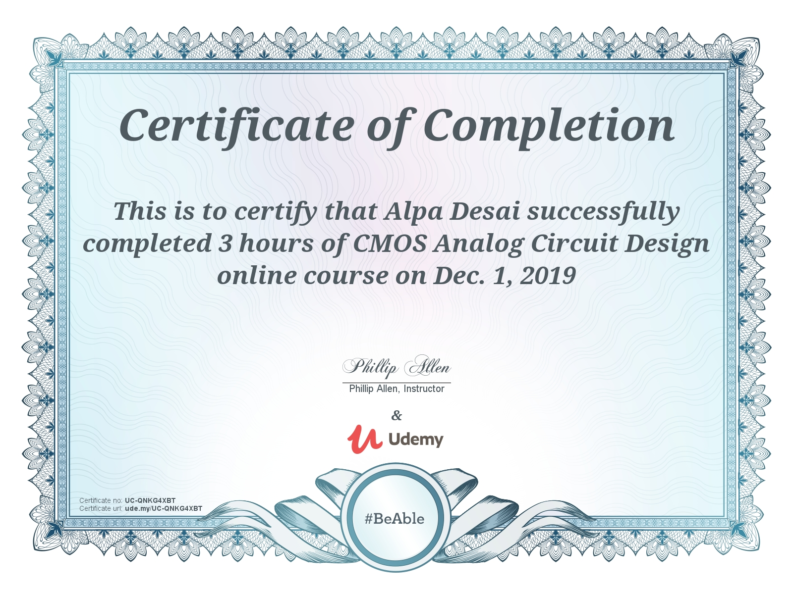
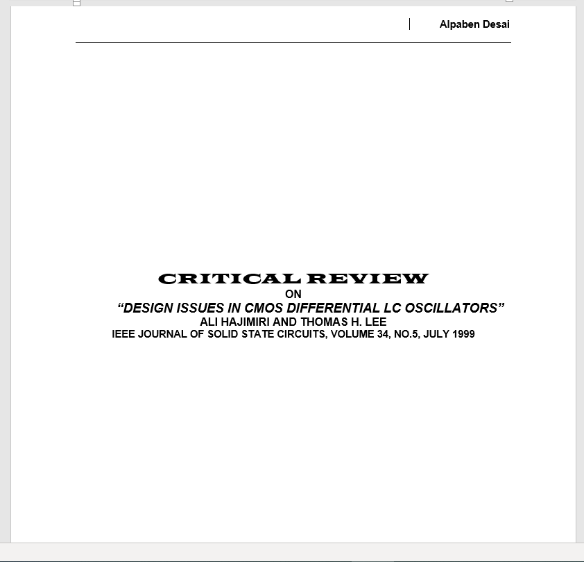
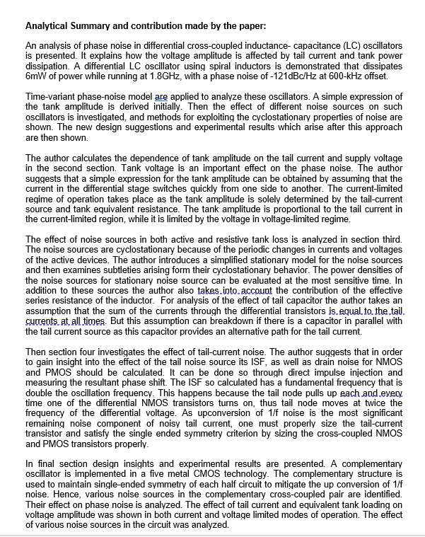
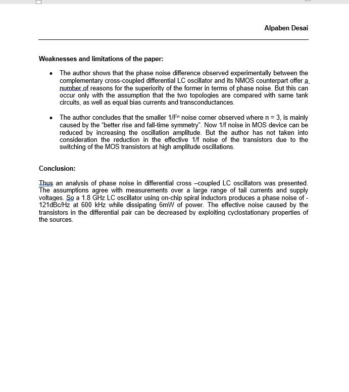

# Analog Design

The project displays technical knowledge on the described topics. Please click on the following link to download the executable:
https://github.com/alpaddesai/AnalogDesign/releases

Company confidential information is not displayed. All images are either custom by Alpa D Desai or a reference name is included.  Most of the images are custom. 

### OrCAD PSpice

## Inverting Amplifier in Virtuoso

## CMOS Analog Design Certification

## Critical Review Analog Integrated Circuit Design 

## Interest

Advanced knowledge please reference: https://github.com/alpaddesai/Microwave-Engineering , https://github.com/alpaddesai/ICPackageDesign, https://github.com/alpaddesai/Optoelectronics and  https://github.com/alpaddesai/SystemLevelDesignProductPortfolioIdea
