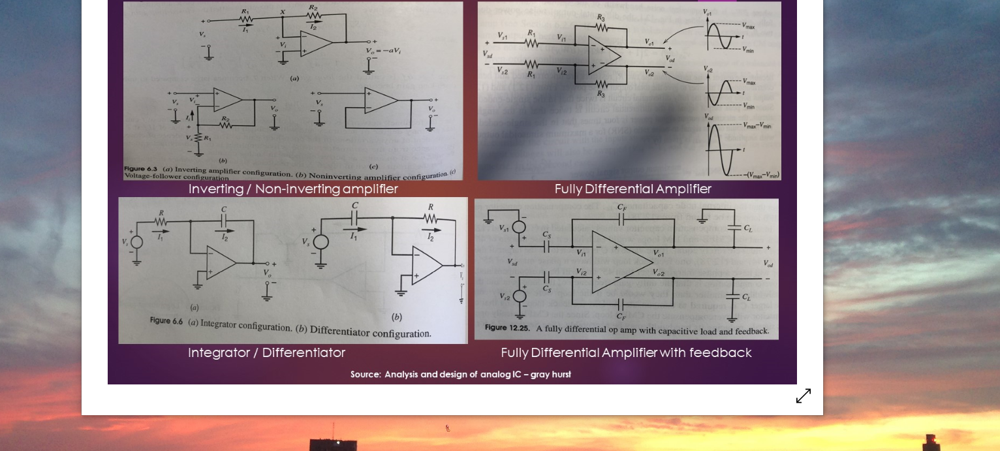
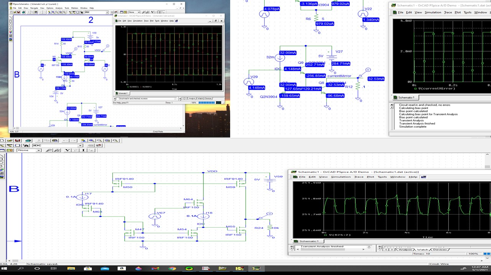
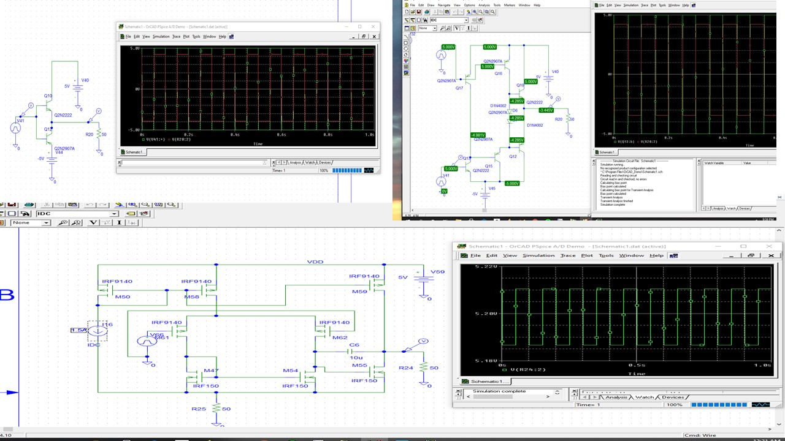
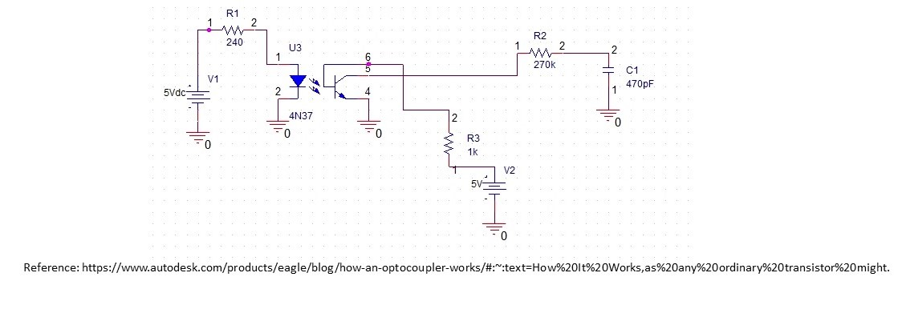
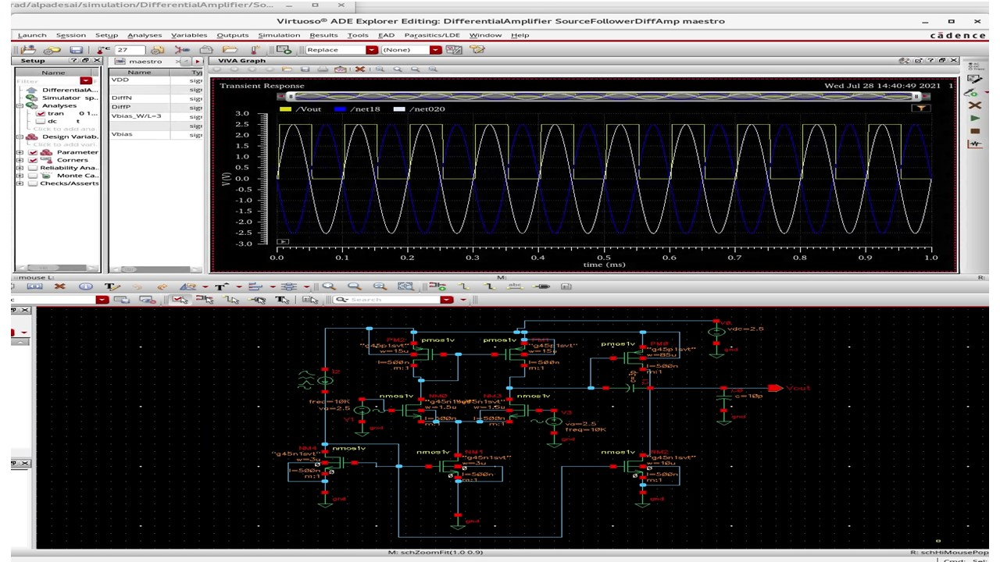
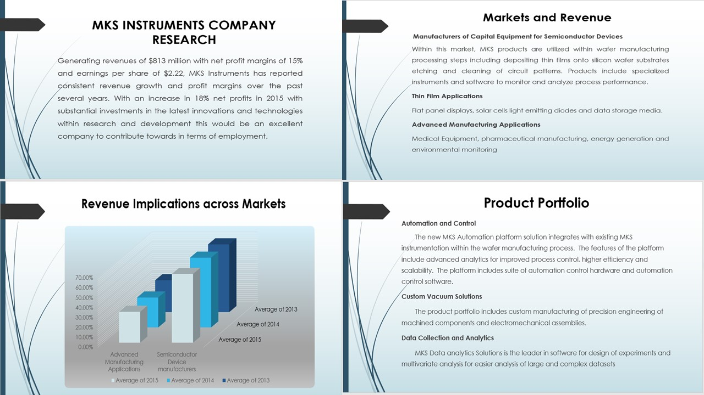
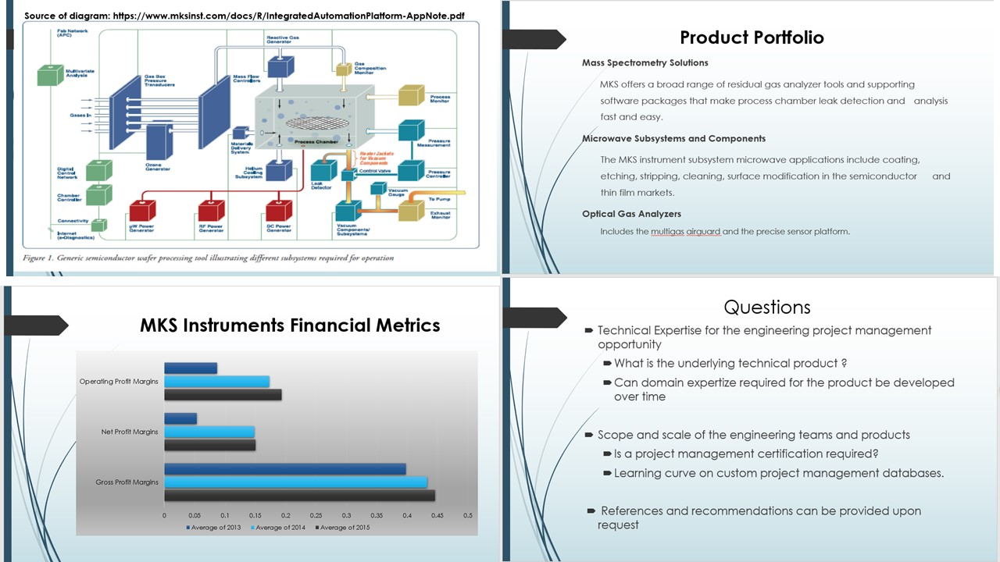

# Analog Design

The project displays technical knowledge on the described topics. Please click on the following link to download the executable:
https://github.com/alpaddesai/AnalogDesign/releases

Company confidential information is not displayed. All images are either custom by Alpa D Desai or a reference name is included.  Most of the images are custom. 

### OrCAD PSpice

### Analog IC Design

## Inverting Amplifier in Virtuoso

## Differential Amplifier

## CMOS Analog Design Certification

## Ethics and Integrity

## Interest

Advanced knowledge please reference: https://github.com/alpaddesai/SmartGridDesignIdea
